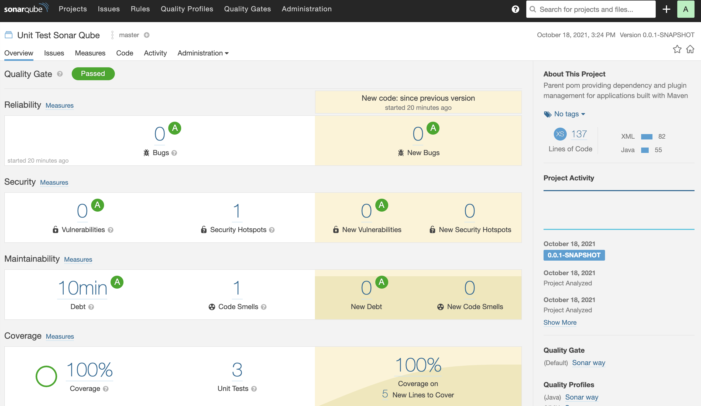

The example project for StringBoot service

<div align="center">
    
</div>

## Getting Started

## Project structure
```
.
├── unit-test-controller
│   ├── Dockerfile
│   ...
├── docker-compose.yaml
|
└── README.md
```

## Start infrastructure

- Start infrastructure

```shell script
$ docker-compose -f ./docker-compose-infrastructure.yml -p sb-unit-test-controller-infrastructure up -d
```

## Run Unit test report

- Run unit test
```shell script
$ cd unit-test-sonar-qube
$ ../mvnw clean test
...
```

- Open report file target/site/jacoco/index.html

<div align="center">
    
</div>

- Report to SonarQube

```shell script
$ cd unit-test-sonar-qube
$ ./sonar_report.sh
```

<div align="center">
    
</div>

## Contribute

## Reference

- https://loda.me/test-huong-dan-toan-tap-mockito-loda1576641016810/
- https://github.com/loda-kun/spring-boot-learning/tree/master/spring-boot-18-testing-in-spring-boot
- https://www.baeldung.com/junit-5
- https://www.baeldung.com/spring-boot-testing
- https://pauledenburg.com/sonarqube-postgres-docker-compose/
- https://www.baeldung.com/sonar-qube